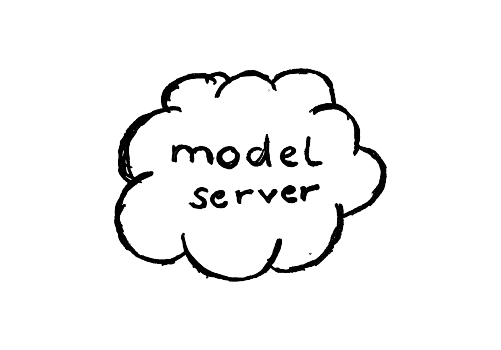
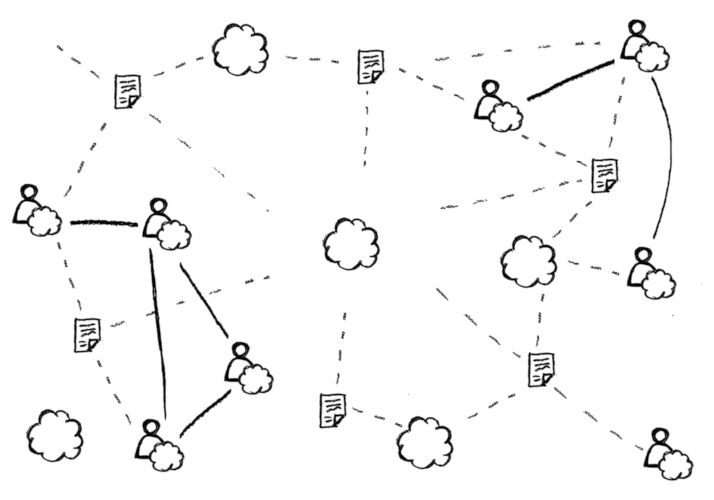
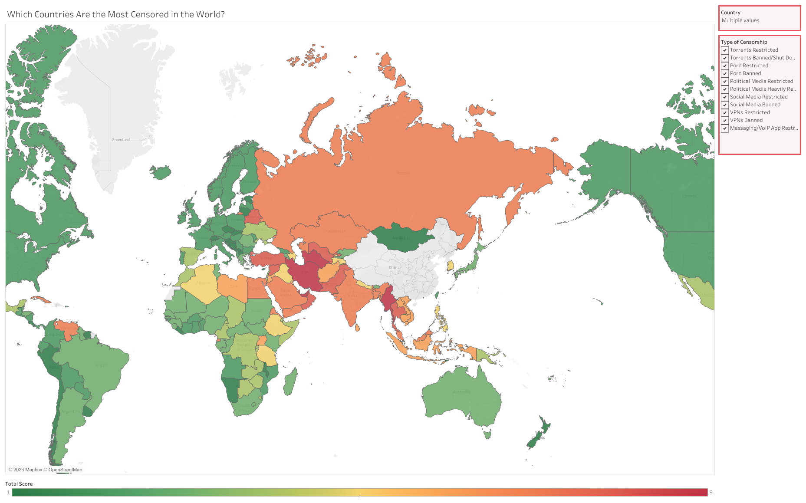

<!--
author: Sebastian Zug

logo:   https://cdn0.scrvt.com/4d3e519fe5939342b95c7312343779ef/fc8202bd3710a2c1/41542924833b/v/757988c13854/eLearning-Africa-2023.png

version: 1.0.0

link:    https://cdnjs.cloudflare.com/ajax/libs/animate.css/4.1.1/animate.min.css
-->

[](https://liascript.github.io/course/?https://github.com/LiaPlayground/Web3_Presentation/blob/main/README.md)

# How to apply Web 3.0 technologies to enable sustainable and community driven online-learning

----------

<div style="width: 46%; float: left;">

__Sebastian Zug, André Dietrich__

__TU Bergakademie Freiberg (Germany)__

</div>

<!-- style="width: 50%; float: right" -->

## Motivation

                      {{0-2}}
**********************************************

Capabilities of a Browser ...
==============================

__What do you think is a modern browser capable of?__

- [[X]] Generating text to speech output
- [[X]] Storing LARGE amounts of data
- [[X]] Cache websites and access them offline
- [[X]] Access your device sensory information (GPS/orientation/light/compass/...)
- [[X]] Connect to another browser directly to exchage audio/video/data
- [[X]] Be a peer in a peer to peer filesharing network
- [[X]] Virtual & Augmented Reality applications
- [[X]] Bluetooth connections

************************************************

                      {{1-2}}
**********************************************

> The Browser is the next Operating System.
>
> --often assigned to Marc Andreessen (Netscape Co-Founder)

************************************************

{{2-4}}
... and their Application in LMSs
================================

                      {{2-3}}
<!-- class="animate__animated animate__zoomIn" -->

                      {{3}}
<!-- class="animate__animated animate__zoomIn" -->

## Technology overview

> This presentation references related technologies and illustrates their application on learning contexts. Feel free to experiment :-)

1. Progressive Web Apps
2. Decentralized Storage & Dissemination
3. Serverless Communication

### 1. Progressive Web Apps

> A __progressive web application (PWA)__, or __progressive web app__, is a type of application software delivered through the web, built using common web technologies including HTML, CSS, JavaScript...
>
> It is intended to work on any platform with a standards-compliant browser, including desktop and mobile devices.
>
> -- Source: [Wikipedia](https://en.wikipedia.org/wiki/Progressive_web_app)

Requirements:

- `manifest.json`: Meta information, base settings
- `ServiceWorker.js`: Used caching strategies
- [[IndexedDB](https://developer.mozilla.org/en-US/docs/Web/API/IndexedDB_API?retiredLocale=de)]: Storing large amounts of data persistently

<!-- style="background: #bdad298f" -->
                     {{1}}
> __Experiment:__ The current LiaScript Website is an example of a progressive web app. Turn on the flight mode and reload the page.
> <!-- style="width: 50%;" -->

### 2. Decentralized Storage & Dissemination

<div style="width:100%;height:0;padding-bottom:80%;position:relative;"><iframe src="https://giphy.com/embed/3ogwFSxwLoc3eNSfyE" width="100%" height="100%" style="position:absolute" frameBorder="0" class="giphy-embed" allowFullScreen></iframe></div><p><a href="https://giphy.com/gifs/feistmusic-century-feist-3ogwFSxwLoc3eNSfyE">via GIPHY</a></p>


#### Inter-Planetary File System

> __The web of tomorrow needs IPFS today__
>
> IPFS aims to complement HTTP in order to build a better web for all of us. 
>
> -- WebSite: https://ipfs.tech

                   {{1}}    
``` ascii

   (Client-Server Architektur)           (Peer-to-Peer (IPFS))
 ┌────────────────────────────┐     ┌────────────────────────────
▒│ 📱 -----.        .----- 💻 │    ▒│     📱---------💻 ┄ ┄ ┄ ┄
▒│          \      /          │    ▒│    / \          \
▒│           \    /           │    ▒│   /   \          \
▒│  💻 ------- 🖥 ------- 📱  │    ▒│ 💻-----💻---------📱 ┄ ┄
▒│           /    \           │    ▒│   \   /  \       /
▒│          /      \          │    ▒│    \ /    \            📱
▒│ 📱 -----'        '----- 💻 │    ▒│     📱-----💻 ┄ ┄ ┄ ┄
▒└────────────────────────────┘    ▒└────────────────────────────
▒▒▒▒▒▒▒▒▒▒▒▒▒▒▒▒▒▒▒▒▒▒▒▒▒▒▒▒▒▒     ▒▒▒▒▒▒▒▒▒▒▒▒▒▒▒▒▒▒▒▒▒▒▒▒▒▒▒▒▒
```

<!-- style="background: #bdad298f" -->
                        {{2}}
> __Experiment:__ Download the [Brave-Browser](https://brave.com) and try to share content via IPFS.
>
> !?[Brave Browser & IPFS](https://www.youtube.com/watch?v=hpwh_zLpnCE)


#### Darknet: Tor & OnionShare

                {{0-1}}


                {{1}}
> The Tor network is an anonymizing network that allows users to obscure their online activities and protect their identity by routing their traffic through a series of volunteer-run Tor servers, making it difficult to trace their actual IP address.
>
> Website: https://www.torproject.org


                 {{2}}
> OnionShare is an open source tool that lets you securely and anonymously share files, host websites, and chat with friends using the Tor network.
>
> sWebsite: https://onionshare.org

<!-- style="background: #bdad298f" -->
            {{3}}
> __Experiment:__ Download the Tor-Browser and OnionShare and try out disseminating.
> You can setup a private chat too.
>
> !?[OnionShare](https://www.youtube.com/watch?v=D2OLpNtbFD8)

### 3. Serverless Communication

> __WebRTC (Web Real-Time Communication)__ is a free and open-source project providing web browsers and mobile applications with real-time communication (RTC) via application programming interfaces (APIs). It allows audio and video communication to work inside web pages by allowing direct peer-to-peer communication, eliminating the need to install plugins or download native apps
>
> Source: [Wikipedia](https://en.wikipedia.org/wiki/WebRTC)

Applications:

- [WebTorrent](https://webtorrent.io): Browser-based torrent capable of streaming videos.
- [Meet.Jit.Si](https://meet.jit.si): Platform for video-chat and online meetings.
- [Instant.io](https://instant.io): Share a file via the Browser.

<!-- style="background: #bdad298f" -->
            {{1}}
> __Experiment:__ Create a Classroom directly from our LiaScript PWA.
>
> !?[Classroom](https://www.youtube.com/watch?v=Kjk6OblugXI)

#### Example: Classroom

What do you think is the most relevant feature for sustainable education.

- [[PWA]] Progressive Web APP & Caching
- [[Decentralized Storage]] Decentralization
- [[Communication]] Browser-based Realtime Communication

## Contact

* Project website: https://LiaScript.github.io
* Code: https://github.com/liascript
* YouTube: https://www.youtube.com/channel/UCyiTe2GkW_u05HSdvUblGYg

---

Edit this course [online](https://liascript.github.io/LiveEditor/?/show/file/https://raw.githubusercontent.com/LiaPlayground/Web3_Presentation/main/README.md).

---

!?[ela23 Tutorial](https://www.youtube.com/watch?v=8UtlwH0o8FI "Record of the eLearing Afrika Tutorial")

---

__Kontakt via:__

* eMail: [LiaScript\@web.de](mailto:LiaScript@web.de)
* Twitter: https://twitter.com/LiaScript
* Chat: https://gitter.im/LiaScript/community


